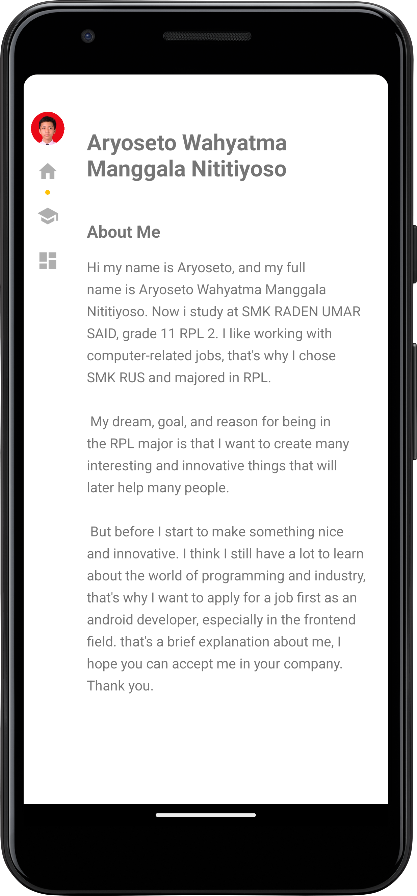
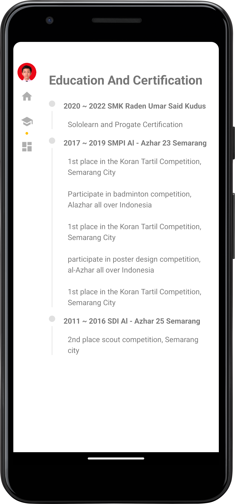
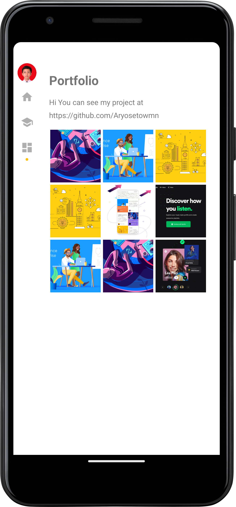

# Portfolio App (Java)

Oct 20, 2021 | A solo Android project I built during 11th grade at vocational school as a portfolio-style application.  
This app was made to practice creating a structured multi-section UI (portfolio, CV, projects) using RecyclerView and modern Android UI components.

---

## Preview (Screenshots)

| Home | Education and Certification | Portfolio |
|---|---|---|
|  |  |  |

---

## Features

- Portfolio-style layout to showcase projects and personal information
- CV / profile section (education & experience)
- RecyclerView-based lists and cards
- Image loading with Glide
- Simple navigation between sections/screens

---

## Tech Stack

- **Language:** Java  
- **Build System:** Gradle  
- **AndroidX:** AppCompat, RecyclerView, Legacy Support  
- **UI:** Material Components, ConstraintLayout  
- **Image Loading:** Glide  
- **compileSdk / targetSdk:** 29  
- **minSdk:** 15  

---

## Project Structure (High Level)

- `app/` — Android application module
- `app/src/main/java/...` — Activities, adapters, models
- `app/src/main/res/` — Layouts, drawables, strings, themes
- `gradle/` + `gradlew*` — Gradle wrapper files
- `docs/` — Screenshots for README

---

## Getting Started

### Requirements
- Android Studio
- JDK 11 (recommended for older Gradle/AGP projects)
- Android SDK Platform 29 installed (compileSdk 29)

### Run Locally
1. Clone the repository:
   ```bash
   git clone https://github.com/Aryosetowmn/androiddev_kelas11semester1_port1.git
   ```
2. Open the project in **Android Studio**
3. Wait for **Gradle Sync** to finish
4. Run on:
   - Emulator (Device Manager), or
   - Physical Android device (USB Debugging enabled)

---

## Notes

This repository is intended for learning and portfolio demonstration.  
If you want to improve it further, a good next step would be applying an architecture pattern (e.g., MVVM), adding a local database (Room), and improving UI consistency with a unified theme system.

---

## Author

**Aryosetowmn**  
Repository: `Aryosetowmn/androiddev_kelas11semester1_port1`
